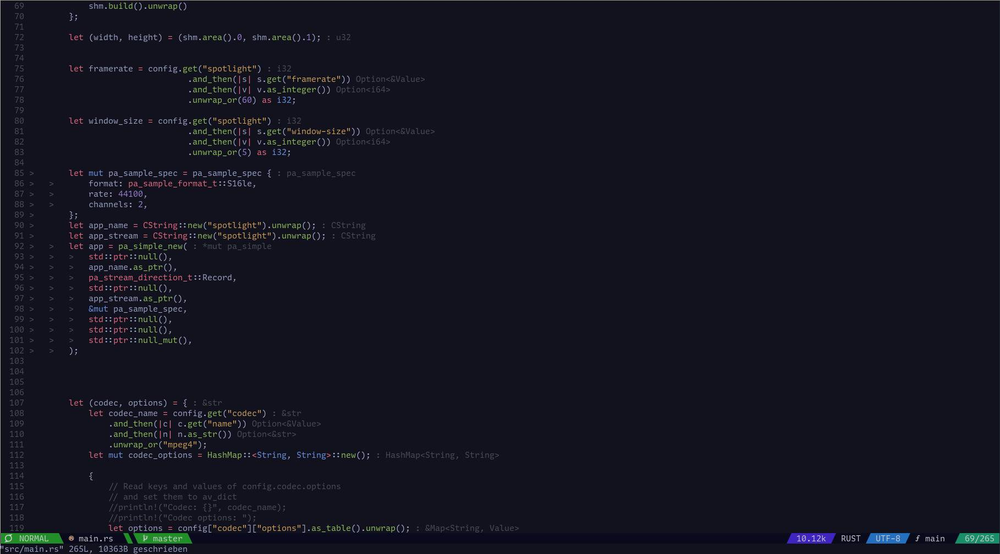

# Virtuality.nvim

A Lua plugin facilitating the LSP [`textDocument/inlayHint`](https://microsoft.github.io/language-server-protocol/specifications/lsp/3.17/specification/#initialize) command to provide virtual text type annotations.

## Example



## Supported LSPs

* rust-analyzer (confirmed)
* any other LSP supporting [`textDocument/inlayHint`](https://microsoft.github.io/language-server-protocol/specifications/lsp/3.17/specification/#initialize) (unconfirmed)

## Installation

Using [`packer.nvim`](https://github.com/wbthomason/packer.nvim)

```lua
use { "27justin/virtuality.nvim" }
```

After installation, every buffer that supports the feature should display type annotations. No need to `setup()` anything.


## Colors

The type annotations are highlighted using `VirtualityInlayHint`, which in itself is linked to `Comment` by default.

## Debugging

Virtuality exports two functions.

* `update(bufnr: integer|nil)` -> updates the annotations for either buffer `bufnr` or the current buffer if nil.
* `check()` -> checks whether any of the LSPs connected to the current buffer support `textDocument/inlayHint`.
	This function is asynchronous, the results are sent using `vim.notify`.

```lua
require"virtuality".update()
require"virtuality".check()
```

### Plugin structure

```
.
├── lua
│   ├── virtuality
│   │   └── module.lua
│   └── virtuality.lua
├── plugin
│   └── virtuality.lua
└── README.md
```
